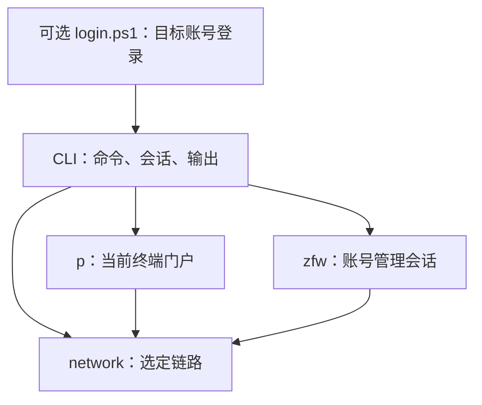

# 内核架构

文件边界对应业务对象、状态生命周期与操作后果。核心由三个 Go 包组成：选定链路 `network.Link`、当前终端门户 `p.Portal`、账号管理会话 `zfw.Session`。

## 文件与责任

```text
network/
  interfaces.go       网卡类型、源 IPv4 选择与校验
  interfaces_std.go   Linux 与 macOS 的网卡枚举
  interfaces_windows.go Windows 原生网卡与地址快照
  link.go             源地址与网卡、HTTP transport、独立客户端、通达性
  bind.go             源地址所属网卡与套接字绑定入口
  bind_*.go           Windows、Linux、macOS 的原生网卡绑定
  http.go             共用 HTTP 执行规则
p/
  portal.go           门户上下文、动态配置、JSONP
  access.go           当前终端状态、认证、注销、认证错误
  password.go         改密与专用图片交互
  selfservice.go      自助服务入口
zfw/
  session.go          管理身份、Cookie、登录退出、会话语言
  html.go             多业务共用的 HTML 与表单原语
  account.go          账号概览、资料、刷新
  connections.go      在线连接、近期登录、指定连接下线
  mac.go              MAC 绑定列表与解绑
  mauth.go            无感知策略
  operator.go         运营商绑定关系
  consume.go          消费保护限额
  bills.go            三类账单查询与导出
  recharge.go         当前充值入口与可用状态
  public.go           公告、帮助、协议
cmd/njupt-net/
  main.go             进程、全局参数、命令分发
  context.go          一次进程的链路、门户实例与账号会话
  session.go          标准输入 JSON 请求与连续响应
  config.go           配置读取、账户别名与凭据选择
  p.go                p 参数与调用
  zfw.go              zfw 参数与调用
  output.go           JSON、文件输出与标准输入交互
integration/
  live_test.go        显式启用的跨包校园网测试
examples/windows/
  login.ps1           按目标账号状态迁移宽带、登录与核对结果
research/             独立 Python 协议研究
docs/                 Markdown 协议说明与开发文档
```

业务测试与源码相邻；共享固定夹具留在同包测试中。每个业务文件拥有自己的输入、返回类型、请求、解析和结果确认。专用解析函数贴近使用者，多处确实共享的规则放在最近的公共边界。

## 依赖与状态

箭头表示调用或依赖：



p 与 zfw 分别通过 `Link.ClientFor(host, ip)` 创建定向客户端，各自拥有独立 CookieJar。域名与部署 IP 的映射由协议包提供；底层直拨该 IP，URL、HTTP Host、TLS SNI 与证书验证继续使用域名。Portal 从 `Link.Source()` 取得认证和状态核验使用的同一源地址。Link 管理只读请求的连接复用与修改请求的新连接，并在 `Close` 时统一清理空闲连接。

`NewLink` 根据源 IPv4 找到唯一启用网卡，拨号器同时设置 TCP `LocalAddr` 与原生网卡绑定。绑定在套接字连接前完成：Windows 使用 `IP_UNICAST_IF`，按网络字节序传入网卡索引；Linux 使用 `SO_BINDTOIFINDEX`，要求内核 5.7 或更新版本；macOS 使用 `IP_BOUND_IF`。同一 Link 创建的普通客户端和固定 IP 客户端沿用该网卡。

Windows 示例由独立 `login.ps1` 组成，所需调用函数包含在同一脚本内。脚本通过一个 CLI `session` 分别读取门户身份与宽带关系，以 `-Account` 指定目标校园账号，运营商取自配置。目标绑定已符合配置时保留；完全为空时查询其他配置账号，按唯一持有人迁移或直接绑定。

门户身份与宽带绑定分别决定所需动作：

| 门户状态 | 目标宽带关系 | 执行动作 |
|---|---|---|
| 目标账号与运营商在线 | 已符合配置 | 使用当前连接 |
| 目标账号与运营商在线 | 需要绑定或迁移 | 完成绑定后重新读取门户；身份与 MAC 保持目标时继续使用当前连接，实际离线时再认证 |
| 其他账号或运营商在线 | 任意 | 通过精确 Self 连接下线并确认门户离线，按需处理绑定，再认证目标账号 |
| 离线 | 任意 | 按需处理绑定，再认证目标账号 |

需要认证时，Windows 脚本在新绑定提交并准确读回后立即认证。仅在本次流程刚完成绑定、且门户明确返回“未绑定运营商账号,请正确绑定运营商账号再试！”时，脚本收到完整拒绝后立即串行发起下一次认证，成功即继续。`BindingTimeoutSeconds` 默认 45 秒，限定从绑定完成起的认证生效观察时间；其他拒绝或请求结果未知时，脚本记录当前阶段并结束流程。输出中的 `binding_activation_seconds` 记录这段实际用时，`login_attempts` 记录认证次数。每次 `p login` 调用只提交一次认证。

依赖方向为 `login.ps1` → CLI → 内核；校园 HTTP、协议解析、凭据提交和单项结果确认由内核完成。一次流程固定源 IPv4，同一源地址的流程互斥；执行期间持有配置文件的只读句柄，阻止写入和替换。脚本使用绑定操作的准确读回结果和登录操作返回的在线身份；默认选择门户 801，指定 `-Probe` 时另行观测公网通达性。流程结束时关闭 CLI 会话；业务步骤失败时保留执行阶段与步骤结果，再次运行从当前状态决定剩余操作。使用说明见 [Windows 示例](../examples/windows/README.md)。

| 对象 | 拥有的状态 | 使用规则 |
|---|---|---|
| `network.Link` | 不可变源 IPv4 与网卡索引、普通与定向 transport、请求超时 | TCP 使用同一源地址和网卡；统一管理连接资源 |
| `p.Portal` | 终端类型、API 端口、原生配置、在线 MAC、JSONP 序号 | 门户目标 IP 必须匹配源地址；单对象操作串行 |
| `zfw.Session` | 独立 Cookie、已确认账号身份、管理会话状态 | 私有业务必须有服务器确认的身份；单对象顺序使用 |
| CLI | 配置快照、账户别名、门户实例、各账号管理会话、参数与输出 | 固定链路，串行分发操作，结束时收回会话和连接 |
| Windows 示例 | 所选链路、账号键、执行阶段与步骤结果 | 通过 CLI JSON 顺序组合业务 |

管理身份与 CSRF 分开。账号刷新、消费保护、运营商绑定或解绑和 MAC 解绑各自读取当前页面提供的令牌，令牌限定于对应操作。

在线连接以 session ID 标识，持续一次上网会话；MAC 绑定以 MAC 标识，可跨多次连接存在；无感知属于账号认证策略；运营商绑定属于账号关系。它们共享管理会话，保留独立业务文件。

## 结果与修改操作

公开业务模型使用 snake_case JSON 字段。业务包完成服务端 JSONP、页面和位置数组的解析，CLI 将业务模型编码为 JSON。

用户资料采用有序标签和值。页面未解释的附加列保留为 `server_field_N`，便于保留原始顺序。账单类别决定结果中唯一的具体账单模型。

每次内核修改调用只提交一次修改请求。p 与 zfw 区分 `accepted`、`rejected`、`unknown`、`not_submitted`，`verified` 独立表达目标状态是否确认。p 登录直接提交原生认证；接受后持续查询，直到选定源 IP 的在线身份匹配提交账号与运营商，原生 `ret_code` 保留其 JSON 值与类型。提交响应无法确认时立即返回 `unknown`，调用者显式决定下一次状态观察。

指定连接下线前重新读取账号在线列表，精确匹配目标 session ID，接受后只读确认该 ID 消失。消费限额、运营商关系和无感知策略分别读取业务页面确认目标值。运营商绑定与解绑共用表单：绑定写入选定账号与密码，解绑将这两字段同时置空；独立读回同时核对目标字段与另一运营商字段。消费保护与运营商操作的 POST 若跳转至已声明的结果页 GET，直接用该页完成读回确认；POST 直接返回 HTML 时，另行 GET 当前业务页核验。

MAC 解绑先取得令牌并查询目标绑定；前提查询失败时返回 `not_submitted`。提交得到明确接受后，分页确认目标消失。服务器拒绝或返回无法识别的处理结果时，命令直接返回该结果。

一项业务操作包含完成该操作所需的鉴权、令牌读取、提交与状态确认。门户登录、状态和自助入口直接调用各自原生接口；注销和改密读取并复用所需动态配置。Self 在同一会话内复用已确认的账号身份，操作专用令牌从当前页面读取。

HTTP 层通过 `network.Read` 执行已确认的只读 GET，复用连接并将重定向作为错误返回。认证与修改通过 `network.Request` 使用新连接提交一次，同样将重定向作为错误返回。需要结果页导航的操作通过 `network.Navigate` 声明允许的同源读取目标：初始请求提交一次，后续跳转采用可复用连接的 GET。站点路径由业务文件声明，307/308 重放请求返回错误。同一固定站点的客户端共享 transport，各自保留独立 CookieJar；TLS 会话缓存减少新连接的握手工作，HTTPS 继续验证服务身份。

## 连续命令会话

`session` 让程序通过一个 CLI 进程连续调用原有命令：

```text
njupt-net --interface Ethernet --config config.json --timeout 15s session
```

标准输入每行一个 JSON 请求，`args` 使用原命令的参数数组，私有命令通过 `account` 选择账号：

```json
{"args":["p","status"]}
{"account":"default","args":["zfw","operator"]}
{"account":"default","args":["zfw","online"]}
{"args":["close"]}
```

标准输出按请求顺序返回单行 JSON，成功与错误使用同一条输出流。响应保留原命令的 `command`、`data` 和可选 `error`，增加 `exit_code`：

```json
{"command":"p status","data":{"source":"192.0.2.10","online":false,"terminal":null},"exit_code":0}
```

`exit_code` 为 `0`、`1`、`2`，分别表示成功、操作错误、参数错误。某条请求出错后，会话继续接收下一条请求。命令从本条请求选择账号，省略 `account` 表示未选择；每个账号别名拥有独立管理会话，Portal 按终端类型和 API 端口分别保存。

源地址、配置路径和请求超时在进程内固定。配置在首次需要凭据时读取一次，随后使用同一快照。各账号首次私有请求完成登录并核对身份，后续请求复用该管理会话。服务器返回会话过期时，本条请求返回错误并移除该账号会话；随后一条请求可建立新会话。每次操作仍读取自身所需令牌并确认结果。

`close` 依次退出全部管理会话、关闭链路资源，返回以下结果并结束进程：

```json
{"command":"close","data":{"closed":true},"exit_code":0}
```

关闭失败时，响应包含错误，退出码为 `1`。标准输入到达 EOF 时也执行清理，进程退出码反映清理结果。会话接收非交互命令；验证码交互 `p password` 与门户签名文件 `--self-url-file` 使用普通单次 CLI 入口。

单次命令与连续会话共用参数解析和业务分发。连续会话负责资源生命周期，账号迁移顺序和绑定生效后的再次认证由外层脚本决定。

## Go API

Go 模块路径为 `github.com/hicancan/njupt-net/v4`，三个内核包分别使用 `/v4/network`、`/v4/p`、`/v4/zfw`。

调用者明确提供源地址与凭据：

```go
source, err := network.SourceAddress("Ethernet", "")
if err != nil {
    return err
}
link, err := network.NewLink(source, 15*time.Second)
if err != nil {
    return err
}
defer link.Close()

portal, err := p.New(link, "pc")
if err != nil {
    return err
}
state, err := portal.Status(ctx)
```

`p.New(link, "pc")` 使用 HTTPS 804；`p.NewAt(link, "pc", 803)` 明确选择 HTTP 803。`Status`、`Configure` 分别直接查询状态与配置；`Login` 直接提交一次普通账号认证，服务器接受后核对在线身份。调用者根据业务需要单独执行 `Status`，并用原始拒绝信息决定后续操作。

`Link.Client()` 创建使用系统 DNS 的普通客户端。`Link.ClientFor(host string, ip netip.Addr) *http.Client` 为指定主机创建固定 IP 直拨客户端，允许该主机名及其指定 IP 两种连接目标，每个客户端有独立 CookieJar。两种客户端的 TCP 连接均绑定 Link 的源 IPv4 与网卡；系统 DNS 查询沿用操作系统解析路径。p 与 zfw 分别维护自身部署映射，`Link.Close()` 统一管理连接资源。

管理调用使用 `zfw.New(link)`，依次执行 `Login(ctx, account, password)`、业务方法、`Logout(ctx)`。已有门户桥时可明确选择 `LoginBridge(ctx, expectedAccount, bridgeURL)` 建立同一种管理会话，并核对最终账号身份。

跨系统动作由调用者显式组合：先由 p 获取自助服务地址，再将签名地址传给 zfw。CLI 的 `--self-url-file` 选择桥登录；密码登录由账户凭据建立会话。两种方法都核对服务器返回的账号身份。

签名桥使用服务器返回的已确认 Self 地址。域名形式使用 zfw 部署映射，IP 形式直接保留原地址与 Cookie 作用域，后续业务和退出管理会话沿用同一客户端。

## 研究与协议维护

Python 研究从实际页面、脚本与原始请求独立恢复协议事实。研究项目保存实验与必要公开样本，Markdown 文档记录协议结论，Go 测试将确认的契约固定为夹具。Go 内核独立构建、运行，真实研究输出由调用者指定位置。

各项动作的必要前提、提交与确认，以及已有结果的复用边界，统一记录于 [原子动作与请求边界](../research/requests.md)。
