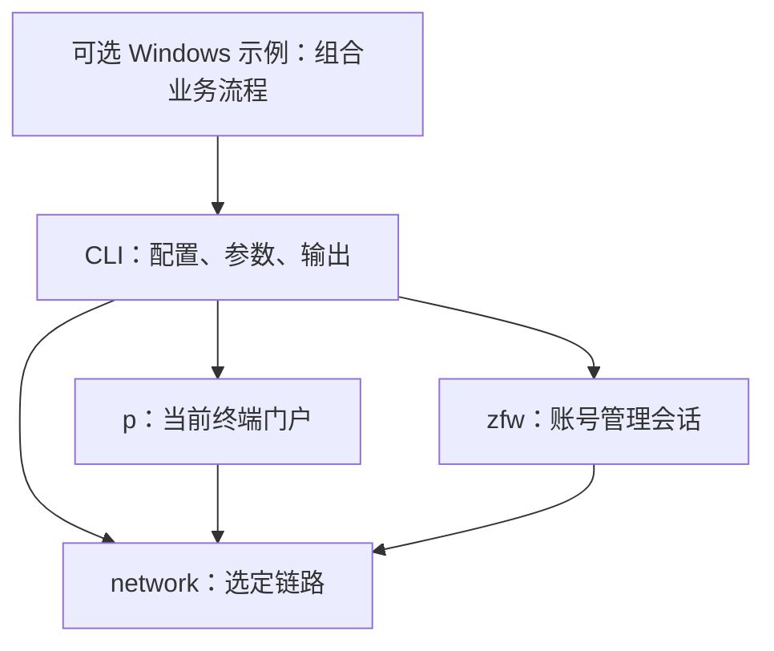

# 内核架构

文件边界对应业务对象、状态生命周期与操作后果。核心由三个 Go 包组成：选定链路 `network.Link`、当前终端门户 `p.Portal`、账号管理会话 `zfw.Session`。

## 文件与责任

```text
network/
  interfaces.go       网卡枚举、源 IPv4 选择与校验
  link.go             源地址、HTTP transport、独立客户端、通达性
  http.go             共用 HTTP 执行规则
p/
  portal.go           门户上下文、动态配置、JSONP
  access.go           当前终端状态、认证、注销、认证错误
  password.go         改密与专用图片交互
  selfservice.go      自助服务入口
zfw/
  session.go          管理身份、Cookie、登录退出、会话语言
  html.go             多业务共用的 HTML 与表单原语
  account.go          账号概览、资料、刷新
  connections.go      在线连接、近期登录、指定连接下线
  mac.go              MAC 绑定列表与解绑
  mauth.go            无感知策略
  operator.go         运营商绑定关系
  consume.go          消费保护限额
  bills.go            三类账单查询与导出
  recharge.go         当前充值入口与可用状态
  public.go           公告、帮助、协议
cmd/njupt-net/
  main.go             进程、全局参数、命令分发
  config.go           配置读取、账户别名与凭据选择
  p.go                p 参数与调用
  zfw.go              zfw 参数、调用与管理会话生命周期
  output.go           JSON、文件输出与标准输入交互
integration/
  live_test.go        显式启用的跨包校园网测试
examples/windows/
  cli.psm1            共享 CLI 调用、JSON 读取与步骤结果
  connect.ps1         连接并检查公网通达性
  disconnect.ps1      按本机 IP 与 MAC 下线当前会话
  switch.ps1          迁移宽带绑定并用新账号连接
research/             独立 Python 协议研究
docs/                 Markdown 协议说明与开发文档
```

业务测试与源码相邻；共享固定夹具留在同包测试中。每个业务文件拥有自己的输入、返回类型、请求、解析和结果确认。专用解析函数贴近使用者，多处确实共享的规则放在最近的公共边界。

## 依赖与状态

箭头表示调用或依赖：



p 与 zfw 各自创建独立 CookieJar，共用指定链路的 transport，分别依赖 network。Portal 从 `Link.Source()` 取得认证和状态核验使用的同一源地址。

Windows 示例通过共享 `cli.psm1` 执行 CLI 并消费 JSON，按配置核对身份和操作前提，组合连接、下线及宽带迁移流程。依赖方向为示例脚本 → CLI → 内核；校园 HTTP、协议解析、凭据提交和单项结果确认由内核完成。一次流程固定源 IPv4，同一源地址的流程互斥；执行期间只读打开配置，每次 CLI 调用前核对内容。示例保留执行阶段与步骤结果，失败时停止。使用说明见 [Windows 示例](../examples/windows/README.md)。

| 对象 | 拥有的状态 | 使用规则 |
|---|---|---|
| `network.Link` | 不可变源 IPv4、transport、请求超时 | 创建的客户端使用同一源地址 |
| `p.Portal` | 终端类型、program/page/version、MAC/VLAN/AC 上下文、JSONP 序号 | 门户目标 IP 必须匹配源地址；单对象操作串行 |
| `zfw.Session` | 独立 Cookie、已确认账号身份、管理会话状态 | 私有业务必须有服务器确认的身份；单对象顺序使用 |
| CLI | 配置、账户别名、参数、输出路径与退出码 | 将明确的源地址和凭据传给内核 |
| Windows 示例 | 所选链路、账号键、执行阶段与步骤结果 | 通过 CLI JSON 顺序组合业务 |

管理身份与 CSRF 分开。账号刷新、消费保护、运营商绑定或解绑和 MAC 解绑各自读取当前页面提供的令牌，令牌限定于对应操作。

在线连接以 session ID 标识，持续一次上网会话；MAC 绑定以 MAC 标识，可跨多次连接存在；无感知属于账号认证策略；运营商绑定属于账号关系。它们共享管理会话，保留独立业务文件。

## 结果与修改操作

公开业务模型使用 snake_case JSON 字段。业务包完成服务端 JSONP、页面和位置数组的解析，CLI 将业务模型编码为 JSON。

用户资料采用有序标签和值。页面未解释的附加列保留为 `server_field_N`，便于保留原始顺序。账单类别决定结果中唯一的具体账单模型。

修改请求只提交一次。p 与 zfw 区分 `accepted`、`rejected`、`unknown`、`not_submitted`，`verified` 独立表达目标状态是否确认。认证成功后按源 IP 和账号核对在线状态；指定连接下线后只读确认目标 session ID 消失。消费限额、运营商关系和无感知策略分别读取业务页面确认目标值。运营商绑定与解绑共用表单：绑定写入选定账号与密码，解绑将这两字段同时置空；独立读回同时核对目标字段与另一运营商字段。MAC 解绑同时保留服务器处理结果与完整列表读回结果。

HTTP 层遇到要求重放请求的 307/308 时返回错误；同源 302 导航转为 GET。每次请求建立独立连接，使具有修改效果的 GET 也遵守单次提交规则。

## Go API

Go 模块路径为 `github.com/hicancan/njupt-net/v3`，三个内核包分别使用 `/v3/network`、`/v3/p`、`/v3/zfw`。

调用者明确提供源地址与凭据：

```go
source, err := network.SourceAddress("Ethernet", "")
if err != nil {
    return err
}
link, err := network.NewLink(source, 15*time.Second)
if err != nil {
    return err
}
defer link.Close()

portal, err := p.New(link, "pc")
if err != nil {
    return err
}
state, err := portal.Status(ctx)
```

管理调用使用 `zfw.New(link)`，依次执行 `Login(ctx, account, password)`、业务方法、`Logout(ctx)`。已有门户桥时可明确选择 `LoginBridge(ctx, expectedAccount, bridgeURL)` 建立同一种管理会话，并核对最终账号身份。

跨系统动作由调用者显式组合：先由 p 获取自助服务地址，再将签名地址传给 zfw。CLI 的 `--self-url-file` 选择桥登录；密码登录由账户凭据建立会话。两种方法都核对服务器返回的账号身份。

## 研究边界

Python 研究从实际页面、脚本与原始请求独立恢复协议事实。研究项目保存实验与必要公开样本，Markdown 文档记录协议结论，Go 测试将确认的契约固定为夹具。Go 内核独立构建、运行，真实研究输出由调用者指定位置。

当前实现使用 HTTPS 804 Portal 与 HTTP 8080 Self。DNS 通过系统解析器查询，TCP4 LocalAddr 绑定源地址，操作系统路由表决定到达目标的路径。
